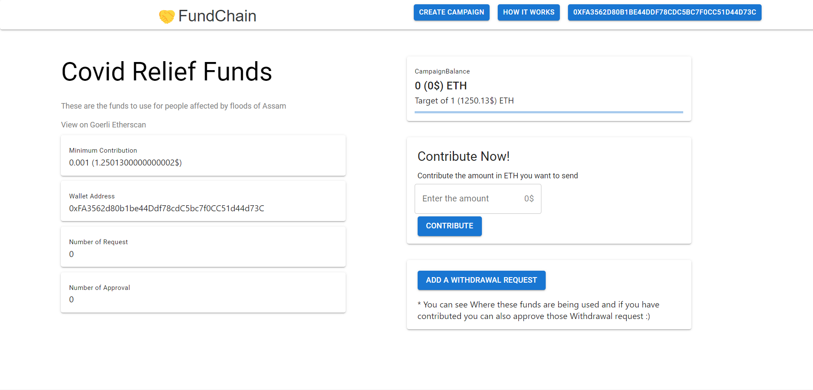

## Introduction
#### Fundchain is Decentralized Web app created using ethereum and smart contracts for crowdfunding where people can create a new campaigns and contributers can contribute to created campaign.

Tech Stack uses - React,Material UI, Context API, Solidity

## Usage

### Home 

### Campaign Details

### Confetti after contributing

### Withdrawal request

